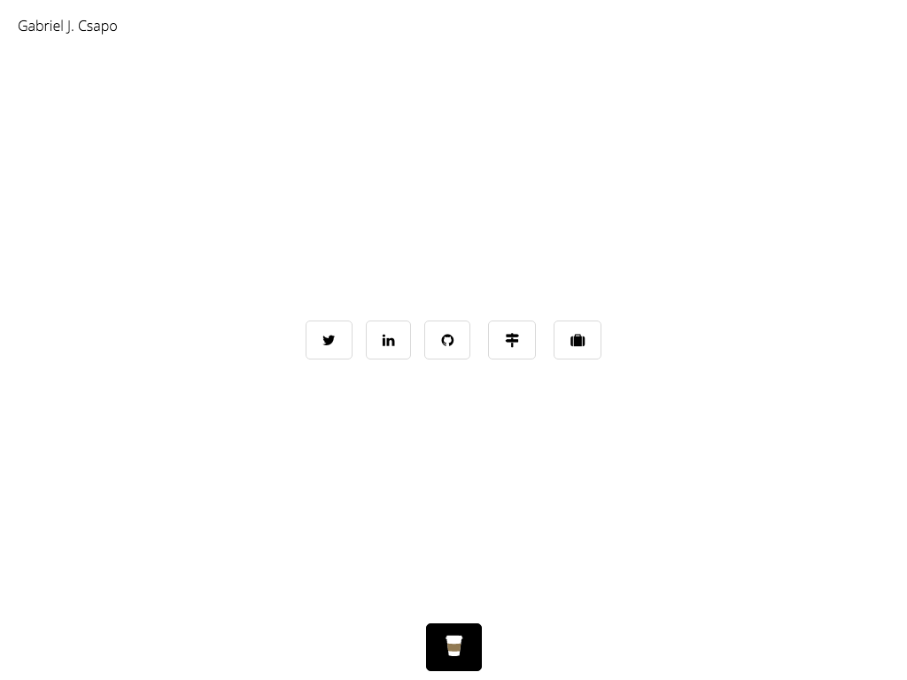

# [gabrielcsapo.com](http://www.gabrielcsapo.com)

> ☕️ personal website (www.gabrielcsapo.com)

[](https://starbuck.gabrielcsapo.com/github/gabrielcsapo/gabrielcsapo.com) [](https://starbuck.gabrielcsapo.com/github/gabrielcsapo/gabrielcsapo.com#info=devDependencies)

## Install

```
npm install;
```

## Usage

```
npm run dev;
open http://localhost:5000;
```



## Contributions

> all contributions are welcome and wanted!

before you submit a pr, please run `npm run test` to update the screenshots directory
